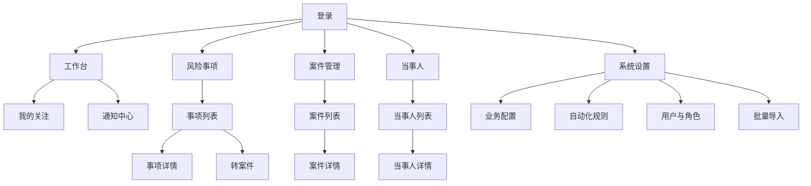
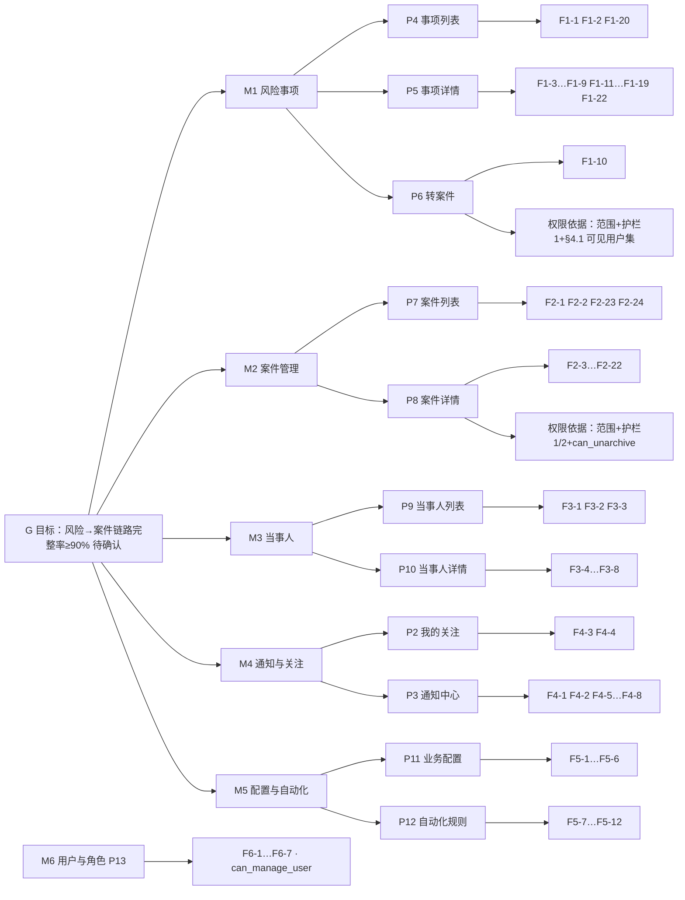

# MatterNest 第一期 PRD 主文档（总纲 + 功能清单 + 设计图集）

> 状态：**草案 v1**。本文件是 PRD 主线索引，不重复规格件的字段/规则细节；凡与其他文件重叠，权威链见 §0.2。
> 生成方式：prd-generator 技能，基线 = `PRD-phase1-baseline-v0.md`（用户 2026-09-26 粘贴），投影数据源 = §4.2 功能清单的 M/F 编号。
> 本轮未编造需求：§2/§3 中凡基线与规格件都没有的，一律标 `【待产品确认】`；§4.2 每条 F 都带出处。

---

## 0. 文档地图

### 0.1 一期文档清单

| 文件 | 角色 | 状态 |
|---|---|---|
| `PRD-phase1-baseline-v0.md` | 需求源（原文口径）+ 「原文 X.Y ↔ 基线节号」对照表 | 仓库新收录，内容不改写 |
| `PRD-phase1-master.md` | 本文件：目标 / 故事 / 功能清单 / 四张图集 / 交付设计 / 冲突登记 | **v3**（十一条裁定已并入；前端路线与入口形态已定） |
| `PRD-phase1-design-revision-r1.md` | 一致性修订 A1–A9 + C，PG 落地 | 已并入 v2 口径（预置规则 8 条、日界定稿）；未闭合项见其 §10 |
| `PRD-phase1-permission-design-draft.md` | 权限与数据范围 | **v4**（新增 §4.1 可见用户集、裁定 P-4/P-5/P-6） |
| `PRD-phase1-enums-and-schemas.md` | **取值权威源** | **定稿 v3**（E01–E37，补 `UNCONVERT` 与认证四组取值） |
| `PRD-phase1-risk-to-case-mapping.md` | 转案件字段映射 | **定稿 v2**（指针与幂等行修正） |
| `tech-stack-decision.md` | 技术选型 | **v6**：全栈 **Next.js 16**（React + **Ant Design 6** + Tailwind v4 只管容器布局），后端仍 TS 同仓；认证双通道（我方适配云之家）。§11/§12 的 Nuxt 结论已被 §13 取代，**v5 的纯 shadcn 前端结论已被 §13.6 取代** |
| `implementation-plan-v1.md` | **落地方案**：门禁 / 里程碑 M0–M7 / 工作分解 WBS / 规范条款 / 验收门禁 / AI 派单边界 | v1，与本文同源 |
| `research-nuxt-fullstack-nitro.md` | 一手核验：Nitro/session/上传/Drizzle DDL | v3 依据；框架结论部分已过期，C1/C3/C4 已搬进技术选型 §13.2 |
| `research-nuxt-table-vue-ui.md` | 一手核验：表格能力与 shadcn-vue 端口 | v4 依据；作对照保留，现行结论看 **§13.6** |
| `research-nextjs-stack.md` | 一手核验：Next 16 proxy 运行时 / 鉴权落点 / 调度 / 多副本 / 自托管 | **v5 依据**，含 N1–N7 spike 通过标准；⚑ 其中"组件体系=shadcn"那部分已被技术选型 §13.6 改判为 antd 6，Next/后端侧结论不变 |

### 0.2 冲突裁决链

`枚举取值` → 枚举表说了算；`权限判定` → 权限草案说了算；`转案件语义` → 映射矩阵说了算；`状态/规则/字段/存储` → 修订稿说了算；`以上都没覆盖的` → 基线 v0；仍然冲突 → 进本文件 §7 排队，不许就地取舍。

---

## 1. 版本说明

| 版本 | 日期 | 变更（跟着 Review 走） | 来源 |
|---|---|---|---|
| v0 | 一期启动 | 基线全文：6 模块 + 14 条交付确认清单 | 用户粘贴，本次入仓 |
| R1 | — | A1–A9 + C 一致性修订，18 项已定基调 | 修订稿 §0/§0.1 |
| B1-v3 | — | 权限模型定稿：三档范围 + 4 特权 + 2 护栏，案例与 MCP 移出 | 草案 §11/§12 |
| B6 | — | 枚举与结构登记表 | 枚举表 |
| D | — | 转案件映射矩阵 | 映射矩阵 |
| T1–T3 | — | 全栈 Nuxt 4 + Drizzle + PG15+ + MinIO | 技术选型 §12 |
| master-v1 | 2026-09-26 | 本次审查：收录基线、补目标/故事/图集/交付设计；登记 P0 冲突 6 条、P1 缺口 12 条 | 本文件 |
| **master-v2** | 2026-09-26（同日） | 你裁定 9 条（Q1–Q5 + P0-2/3/4/5 + 基线版本确认）→ 六份文件同步回改：枚举权威回改 5 处、失效指针 7 处、新增 E29–E33、补 `UNCONVERT`、预置规则 7→8 条、草案新增 §4.1 与 P-4/P-5、报表收窄、§9 误引纠正。唯一未决 = P0-6 | 本文件 §7.3 |
| master-v3 | 2026-09-26（同日） | 认证决策落定：**云之家 + 本地密码双通道**（密码只给兜底账号；首登自动建号落 `pending`）。新增 F6-8…F6-11 与 3 张认证外挂表、枚举 E34–E37 与 `USER_ACTIVATED`；§7 假设 C 作废并新增 E/F；技术选型 §2/§5/"216 例"/§10 条目四处矛盾修平。 | 技术选型 §3.4 |
| master-v4 | 2026-09-26（同日） | 认证口径最终定为**我方适配云之家**（非改造平台），连带离职回收降级为待签字风险（P1-16）；前端定稿纯 shadcn **（当时落点为 Vue 端口）**，P1-17 结案（**PC 浏览器为主**）；补做 `research-nuxt-table-vue-ui.md` 一手核验并登记未证实项 | 技术选型 §3.3/§7/§12、研究文档 |
| **master-v5** | 2026-09-26（同日） | 技术选型升 **v5**：前端换 **Next.js 16 + React + 纯 shadcn**，后端仍 TS 同仓（明确**不进 Python**——shadcn 一等来自 React，与后端语言无关；换 Python 会破枚举表 §5.1 单一事实源）。新增 `implementation-plan-v1.md` 落地方案与 `research-nextjs-stack.md` 一手核验（Next 16 proxy 默认 Node 运行时、鉴权须落在每个 handler、多副本两个必需变量） | 技术选型 §13 |
| **master-v6** | 2026-09-28 | 技术选型升 **v6**：**前端组件体系由纯 shadcn 改判为 Ant Design 6**（用户两次否同一套观感并定方向；`@ant-design/pro-components` 的 peer 不含 antd 6 ⇒ ProTable/ProForm 出局，查询区与表格壳自己写）。禁令⑦⑧ 改写为"体系唯一 + 色值单源 + 服务端分页门不变"，日期库换 `dayjs`，表单校验仍从 `shared/schema` 的 Zod 推导。**需求、权限模型、枚举、里程碑与门禁一条没变**；11 项依赖出仓、14 个 shadcn 原语删除、Demo 轮约 1.5 天视觉工作作废（代价记在 §13.6.4） | 技术选型 §13.6 |

---

## 2. 背景与目标

**背景（基线 1.1 + 项目定位）**：律所内部法务/案件团队约 20 人，风险事项与案件目前分散在台账与个人记录里，"风险 → 案件"的转化链路没有系统承载：转案件时字段靠手抄、期限靠记忆、关注人靠口头，结案后材料封存无人回收。MatterNest 以台账式管理为起点，把这条链做成一条有状态、有节点、有审计的生命周期。

**目标【待产品确认】**：基线全文没有可衡量目标，修订稿 §10 G 自认非功能需求为 0。以下是按 20 人规模给的建议值，需要你逐项签字才算定稿：

| # | 建议目标 | 依据 |
|---|---|---|
| G1 | 上线 3 个月内，新发生风险事项 100% 在系统登记（不再回台账） | 基线以"台账式管理"为起点，登记率是唯一能早期观测的指标 |
| G2 | 风险事项→案件转化链路的完整率 ≥90%（转出的案件能在事项详情反查，且无"绕过转案件直接建案"） | 项目核心差异化能力；绕过率靠 §6.1 埋点 E2/E3 对比 |
| G3 | 期限类节点提醒到达率 100%，超期未处理节点数在 3 个月内下降 50% | 规则 5/6 + `remind_days`；台账时代最大风险是错过期限 |
| G4 | 归档案件的材料完整率（附件 + 活动日志齐全）≥95% | 结案后无人补录，只能靠上线后统计 |

---

## 3. 故事介绍

### 3.1 场景描述（一行一件事，来自基线功能地图 + 规格件）

```text
同事从云之家工作台点进应用，授权回调即完成登录，不必再记一个密码
运维留了一个本地密码账号兜底，云之家不可达时才用它进来
所内有人离职，在职同步把他置为停用并当场吊销会话，他手里的案卷链接立刻 404
律师收到客户投诉，登记一条风险事项（FX-20260926-001），选风险等级"高"
系统按预设生成受理/核查/反馈三个节点，提醒默认 {7,3,1} 天
承办人把同事加为协办与关注人——该同事随即获得本案全部读写
核查后确定起诉，详情页点「转案件」，一次生成 2 个案件（AJ-…-001/-002）
案件字段逐项补录：案由、审级、诉讼地位、标的额、受理机关、当事人角色
事项挂上"已转案件"徽标与关联案件列表，按预置规则 7 自动归档
案件进入"进行中"，规则 3 生成举证/开庭/判决节点模板
开庭时间确认后填 end_time，判决节点时间未定就留"待定"
每周录进展，附件传起诉状与判决书，评论里 @ 协办讨论管辖异议
费用只记支出，详情页看得到按项目分组合计
开庭前 3 天系统给承办人和关注人发提醒，同一天多条提醒合并为一条
结案后承办人手动改状态"已结案"，补 closing_date，长期停留不归档
管理员启用规则 1 后，结案才自动归档
归档后列表默认隐藏，材料只读但评论与附件仍可追加，仅 full_admin 可撤销归档
律师在"我的关注"看未读更新，点进去直接落到对应案件
被 @ 的人在通知中心看到评论摘要，点进去按当前权限渲染正文
客户名在两个案件里出现，当事人详情页能看到"我可见的"关联案件
助理只想看自己承办的，角色给 self_operator（L3）
IT 只管配置和账号，看不到别人的案卷（sys_admin 刻意压到 L3）
风控要撤销一次误归档，只能找持有 full_admin 的人
```

### 3.2 价值分析

| 功能 | 解决什么 | 支撑哪个目标 |
|---|---|---|
| 转案件（1:N + 可追加） | 现在手抄字段，关联一断就查不到源头 | G2 |
| 状态配置驱动 + `semantics` 锚点 | 各所习惯叫法不同，硬编码状态永远要改代码 | G1 |
| 5 触发 × 5 动作规则 + 同域唯一 | 提醒靠人记；规则放开成通用引擎会失控 | G3 |
| `last_progress_at` 与系统写入解耦 | "30 天无更新"被自动化自己刷掉，提醒永不触发 | G3 |
| `*_staff` 作权限主表 | 20 人规模没有部门，只能靠"我与这条记录的关系"分级 | G1（敢用才会填） |
| 当事人跨案共享 + 加密脱敏 | 同一客户在多个案卷里，重复录入且证件号裸存 | G4 |
| 通知按 `dedupe_key` 聚合 | 一次转案件推 5 条，用户两周后就开始屏蔽通知 | G3 |

### 3.3 用户核心路径

```text
风险事项路径：登记 → 预设节点 → 处置/核查 → 转案件(1:N) → 事项归档
案件路径：    转案件/新建 → 进行中(P2 生成节点) → 节点推进+进展+费用 → 已结案 → 已归档(终态)
横穿：        关注人=授权 → 通知/关注 feed → 明文查看/导出 → 撤销归档(仅 full_admin)
```

### 3.4 漏斗目标【待产品确认】

| 步骤 | 建议转化率 | 理由 |
|---|---|---|
| 事项登记 → 产生至少一条进展 | ≥85% | 登记率靠行政要求，进展是真使用信号 |
| 事项 → 转案件（有转化需求的子集） | ≥90% 走系统而非"直接新建案件" | 这条是整个产品的价值命门；<70% 说明转案件表单太重 |
| 转案件表单进入 → 提交成功 | ≥70% | 一表单交 N 个案件、必填 6 项，中途放弃率天然偏高 |
| 提醒发出 → 用户在期限内处置节点 | ≥60% | 台账时代无基线，第一期只测趋势不设 KPI 门槛 |
| 结案 → 30 天内归档 | ≥80% | 规则 1 默认禁用，靠人工动作 |

### 3.5 路径规划（让架构提前兼容，不代表承诺做）

第二期候选：案例库（`case_study.matter_id` 唯一，禁回补 `case_id` 列）、MCP 授权页、全局搜索（第一个真需要中文分词的地方）、按团队/分所隔离（=权限模型重写）、通知渠道扩展（企微/钉钉，E25 留位）、`or`/聚合的规则引擎（区分内置规则与用户可配规则两张表）、费用审批流（E20 预留 `approved` 语义位）、智能体配置（范围未裁决，见 §7 P1-6）。

---

## 4. 概要设计

### 4.1 模块图

| 模块 | 名称 | 第一期 | 出处 |
|---|---|---|---|
| M1 | 风险事项 | ✅ | 基线三 + 修订稿 §3 |
| M2 | 案件管理 | ✅ | 基线四 + 修订稿 §6 |
| M3 | 当事人信息管理 | ✅ | 基线八 + 草案 §7.2 |
| M4 | 通知与关注 | ✅ | 修订稿 §7.2 + 草案 §7.1 |
| M5 | 配置与自动化规则 | ✅（范围待收口，见 §7 P1-6） | 基线七/十三 + 修订稿 §2/§4 |
| M6 | 账号与权限 | ✅ | 草案 §1–§6 |
| M7 | 通用能力（导入/搜索/编号/审计管线） | 部分 | 基线十一 + 修订稿 §12.3 |
| M8 | 报表 | ✅ **收窄为 2 张**：案件/事项总览 + 案程节点到期，形态是列表页顶部统计卡，**不建报表页、不进菜单**（2026-09-26 裁定 P0-2） | 基线六 → 现口径见 §4.2 M8 |
| — | 案例管理 | ❌ 移出 | 修订稿 §0.1 / §9 #10 |
| — | MCP 服务与授权页 | ❌ 移出 | 修订稿 §9 #13 |
| — | 智能体配置（基线 7.4） | ❓ 未裁决 | 基线 7.4，无承接 |
| — | 自定义字段/自定义报表/自定义列 | ❌ 不做 | 基线清单 #14 |

### 4.2 功能清单（穷举，M/F 编号 = 全部图集的数据源）

标记：`✅` 规格件已闭合；`❓` 有承诺但无规格；`⚠` 与其他文件冲突（编号见 §7）。

**M1 风险事项**

| F | 功能 | 状态·出处 |
|---|---|---|
| F1-1 | 新建事项（P1 预设节点 + `FX-` 取号） | ✅ 修订稿 §4 / 映射 §2.1 |
| F1-2 | 列表：筛选·搜索·排序·分页·「包含已归档」开关 | ✅ 修订稿 §5 |
| F1-3 | 事项详情查看（第二徽标"已转案件"） | ✅ 修订稿 §3.2 |
| F1-4 | 编辑事项业务字段 | ⚠ P0-6（护栏未定义"改主表字段"归谁） |
| F1-5 | 删除事项（软删） | ❓ P1-8（B8 未决） |
| F1-6 | 状态变更（软推荐 + 偏离必填原因） | ✅ 修订稿 §3.3 |
| F1-7 | 归档 / 撤销归档 | ✅ 修订稿 §3.3 终态 + `can_unarchive`；基线 4.2"自动撤销归档"那句作废（P0-3 裁定） |
| F1-8 | 事项节点增删改 | ⚠ P1-13（仅时间点 vs `time_type` 全支持） |
| F1-9 | 节点完成 / 取消 / 恢复 | ✅ 修订稿 §3.5 |
| F1-10 | 转案件（1:N，可追加，单事务 + outbox） | ✅ 映射 §4 |
| F1-11 | 撤销转案件关联 | ✅ 映射 §5.1 |
| F1-12 | 协办 / 关注人增删（= 授权） | ⚠ P1-12（基线 3.1 无 co_owner） |
| F1-13 | 收藏 ⭐ | ✅ 修订稿 §8.1 `user_watch` |
| F1-14 | 评论 / @提及 / 回复 | ⚠ P1-11（基线"评论不可编辑"） |
| F1-15 | 标签 / 风险等级设置 | ✅ 枚举 E15 / 基线 4.8 |
| F1-16 | 自定义提醒增删 | ✅ 枚举 E23/E24 |
| F1-17 | 附件上传（预签名 PUT）/ 下载（60s URL） | ✅ 修订稿 §7.1 |
| F1-18 | 活动日志查看 | ✅ 枚举 §3 |
| F1-19 | 关联案件列表与跳转 | ✅ 映射 §2.1 |
| F1-20 | 事项列表导出（默认脱敏） | ✅ 草案 §7.3 |
| F1-21 | 事项批量操作 | ❓ P1-9（基线未定义动作范围） |
| F1-22 | 提醒扫描（节点 / 自定义 / 规则，跨两张节点表） | ✅ 修订稿 §7.2 |

**M2 案件管理**

| F | 功能 | 状态·出处 |
|---|---|---|
| F2-1 | 新建案件（`AJ-` 取号、案号非唯一仅提示重复） | ✅ 修订稿 §6.3 / §12.3 |
| F2-2 | 列表 + 筛选（状态/等级/类型/承办/标签/时间）+ 包含已归档 | ✅ 基线 14.1 + 修订稿 §8.2 |
| F2-3 | 案件详情（卡片墙 + Tab） | ✅ 基线 14.2 |
| F2-4 | 编辑案件业务字段 | ⚠ P0-6 |
| F2-5 | 删除案件（软删） | ❓ P1-8 |
| F2-6 | 状态变更（软推荐 + 偏离原因） | ✅ 修订稿 §3.3 |
| F2-7 | 归档 / 撤销归档 | ✅ 同 F1-7（基线 4.2"自动撤销"作废） |
| F2-8 | 案程节点 CRUD（P1 预设 + P2 规则 3 模板） | ✅ 修订稿 §4 |
| F2-9 | 节点时间待定 + `deadline_time` 派生 + 时间段校验 | ✅ 修订稿 §6.1 |
| F2-10 | 节点提醒 `remind_days integer[]` | ✅ 修订稿 §4 |
| F2-11 | 案件进展登记（时间线倒序） | ✅ 基线 4.4 + 枚举 E19 |
| F2-12 | 费用登记（仅支出，无审批） | ✅ 枚举 E20 |
| F2-13 | 费用汇总与按项目分组（`SUM(amount)`） | ✅ 修订稿 §6.3 |
| F2-14 | 承办 / 协办 / 关注人管理 | ✅ 草案 §5/§6 |
| F2-15 | 当事人关联 + 快速新增 + 引用同步提示 | ✅ 映射 §2.6 / 基线 8.2 |
| F2-16 | 评论 / @提及 / 回复（≤1 层） | ⚠ P1-11 |
| F2-17 | 标签 / 风险等级 | ✅ 基线 4.8 |
| F2-18 | 收藏 ⭐ | ✅ 修订稿 §8.1 |
| F2-19 | 自定义提醒 | ✅ 枚举 E23 |
| F2-20 | 附件 Tab（原文缺，已补） | ✅ 修订稿 §7.1 |
| F2-21 | 活动日志查看 | ✅ 枚举 §3 |
| F2-22 | 来源风险卡片（含"无权查看来源风险的 N 个附件"占位） | ✅ 映射 §2.8 |
| F2-23 | 案件列表导出（脱敏 / 明文两档） | ✅ 草案 §7.3 |
| F2-24 | 案件批量操作 | ❓ P1-9 |
| F2-25 | 生成案例（1:1） | ❌ 移出第一期 |

**M3 当事人**

| F | 功能 | 状态·出处 |
|---|---|---|
| F3-1 | 当事人列表 / 搜索（"部分结果因权限未显示"） | ✅ 草案 §7.2 |
| F3-2 | 新建 / 编辑当事人（仅名称必填） | ✅ 基线 8.1 + 清单 #11 |
| F3-3 | 查重：名称模糊 + `id_number_hash` 精确 | ✅ 修订稿 §6.3 |
| F3-4 | 详情页"涉及案件/事项"（总数按可见计） | ✅ 草案 §7.2 |
| F3-5 | 证件号 / 手机号明文查看（记审计） | ✅ 草案 §7.3 |
| F3-6 | 当事人标签 | ✅ 修订稿 §8.1 `party_tag` |
| F3-7 | 删除当事人（被引用时） | ❓ P1-8 |
| F3-8 | 敏感字段加密存储与默认脱敏 | ✅ 基线 → 修订稿 §6.3（细则 B7 未完） |

**M4 通知与关注**

| F | 功能 | 状态·出处 |
|---|---|---|
| F4-1 | 通知中心列表（未读 / 已读） | ✅ 修订稿 §7.2 |
| F4-2 | 未读计数徽标（按可见行计） | ✅ 草案 §7.1 |
| F4-3 | 我的关注 feed（跨宿主时间倒序 + 不可见降级占位） | ✅ 草案 §7.1 |
| F4-4 | 已读标记 `last_read_at` | ✅ 修订稿 §8.1 |
| F4-5 | 投递与重试（`in_app` / `email`） | ✅ 枚举 E25 |
| F4-6 | 事件聚合与去重（`dedupe_key` + `event_batch_id`） | ✅ 修订稿 §7.2 |
| F4-7 | 通知正文读取时实时鉴权渲染 | ✅ 草案 §7.1 |
| F4-8 | 关注人通知范围 = **新评论 + 状态变更**两类 | ✅ P0-5 裁定（2026-09-26）：预置规则 2 泛化为任意状态变更，新增规则 8 `event_occurred:comment_added`；其余更新不再推送 |

**M5 配置与自动化规则**

| F | 功能 | 状态·出处 |
|---|---|---|
| F5-1 | 状态配置：新建仅 `custom`、改名改色排序、code 不可改 | ✅ 修订稿 §3.1 + 枚举 E09 |
| F5-2 | 状态停用（被启用规则引用则阻止） | ✅ 修订稿 §2.2 |
| F5-3 | 节点类型配置（`host_type` / `preset_on_create` / `template_code`） | ✅ 修订稿 §4 |
| F5-4 | 费用项目配置 | ✅ 基线 7.6 |
| F5-5 | 风险等级配置 | ✅ 基线 7.7 |
| F5-6 | 标签配置（分组、颜色） | ✅ 基线 7.8 |
| F5-7 | 规则列表与详情 | ✅ 基线 14.4 |
| F5-8 | 新建规则（5 触发 + 参数 schema + 字段/动作白名单校验） | ✅ 枚举 §4 |
| F5-9 | 规则启停与同域同动作冲突处理（含一键替换） | ✅ 修订稿 §2.2 |
| F5-10 | 预置规则管理（`is_system`：可调参可停用，不可删不可改 trigger） | ✅ 修订稿 §2.1 |
| F5-11 | 规则执行记录（EXECUTED / SKIPPED / FAILED） | ✅ 枚举 §3.4 |
| F5-12 | 通知模板（第一期只 seed，无管理入口；文案属 B5） | ❓ P1-7 |
| F5-13 | 存储配置（类型 / 路径 / 大小 / 白名单 / 预览开关） | ❓ P1-6 未裁决 |
| F5-14 | 提醒配置：默认提前天数 / 多级 / 重复 / 超期升级 | ❌ 超期升级与多级无规格（P1-6） |

**M6 账号与权限**

| F | 功能 | 状态·出处 |
|---|---|---|
| F6-1 | 用户列表与启停 | ✅ 草案 §3 |
| F6-2 | 角色管理（5 内置 + 自建）与数据范围三档 | ✅ 草案 §1/§2 |
| F6-3 | 授予 / 回收角色（禁止自助提权） | ✅ 草案 §6 |
| F6-4 | 4 个特权开关配置 | ✅ 草案 §2.1 |
| F6-5 | 权限变更审计 `ROLE_CHANGED` | ✅ 枚举 §3.3 |
| F6-6 | 登录 / 登出：**云之家 + 本地用户名密码双通道**，统一服务端 session | ✅ 2026-09-26 裁定（技术选型 §3.4；权限草案 §11 P-6） |
| F6-7 | 可选用户查询（加参与人用，按可见用户集过滤） | ★ Q1 收窄新增，见 §7.3；技术落点带宿主上下文的 `selectable-users` |
| F6-8 | 云之家授权回调 → `eid`/`openId` → 与本所账号绑定 | ✅ 技术选型 §3.4；`app_user_external_identity` UK(provider, external_id) |
| F6-9 | 本地密码凭据管理（设置/改密/失败锁定），**仅 `sys_admin` 与兜底账号可开通** | ✅ 技术选型 §7 假设 E 裁定（2026-09-26）：全员双通道被否决，避免一人一凭据的人工停用面 |
| F6-10 | 在职同步与离职回收：外部账号不可见即 `is_enabled=false` + 吊销 session + `token_version++` | ⚠ 取决于云之家能否列成员：能列 → 扫描式自动回收；只能按 `eid` 查单人 → 降级为"登录时校验 + 长期未登录告警 + 人工停用"（技术选型 §3.4 分叉条，残余风险见 P1-16）。边界不变：只判在职，不落部门、不参与谓词 |
| F6-11 | 待开通队列：云之家首登自动建号落 `pending`，管理员批准并当场指定角色（写 `USER_ACTIVATED`） | ✅ 技术选型 §7 假设 F 裁定；`pending` 账号不可被加为参与人（草案 §6） |

**M7 通用能力**

| F | 功能 | 状态·出处 |
|---|---|---|
| F7-1 | 编号生成器（`FX/AJ/AL-` + 业务时区日界 + 溢出扩 4 位） | ✅ 修订稿 §12.3 + 本轮 Q3 |
| F7-2 | 活动日志写入管线（含 `payload` 与 `reason`） | ✅ 枚举 §3 / §5.4 |
| F7-3 | 附件签名签发（PUT 直传 + 60s 下载） | ✅ 修订稿 §7.1 + 技术选型 C3 |
| F7-4 | 批量导入（案件 / 事项 / 当事人历史数据） | ❓ P1-4 原型缺 |
| F7-5 | 全局搜索 | ❓ 第二期候选 |
| F7-6 | 详情页 Tab 框架（基本信息 / 进展 / 节点 / 费用 / 评论 / 附件 / 日志 / 提醒） | ✅ 基线十一 + 修订稿 §7.1 |
| F7-7 | 自定义字段 / 自定义列表列 | ❌ 清单 #14 |

**M8 报表（2026-09-26 裁定：一期只做 2 张，形态为统计卡，不建页）**

| F | 功能 | 状态·出处 |
|---|---|---|
| F8-1 | 案件/事项总览统计卡（按状态·等级计数，随筛选联动，只算可见行） | ✅ 基线六 1-2 张收敛 + 草案 §7.2"总数按可见计" |
| F8-2 | 案程节点到期统计卡（未来 7/30 天 + 已超期，跨两张节点表 UNION） | ✅ 基线六第 7 张 + 修订稿 §8.2 `ix_node_scan` |
| F8-3 | 费用统计 / 案件趋势 / 人员工作量 / 当事人关联 | ❌ 后移第二期；"人员工作量"是第一个真需要组织维度的，届时重开草案 §9 |

### 4.3 ① 菜单结构树



```text
登录
├── 工作台
│   ├── 我的关注
│   └── 通知中心
├── 风险事项
│   └── 事项列表
│       ├── 事项详情
│       └── 转案件（自详情页发起，深度仍为 3）
├── 案件管理
│   └── 案件列表
│       └── 案件详情
├── 当事人
│   └── 当事人列表
│       └── 当事人详情
└── 系统设置
    ├── 业务配置（状态 / 节点类型 / 费用项目 / 等级 / 标签，单页多 Tab）
    ├── 自动化规则
    ├── 用户与角色
    └── 批量导入
```

MCP 授权页（基线 14.5）、案例库、报表（M8 待裁定）、全局搜索不进树。

**对齐约定**：树里分两类节点——分组节点 5 个（工作台 / 风险事项 / 案件管理 / 当事人 / 系统设置）与页面节点 14 个（`登录` 既是根又本身是页面，按页面计）。校验口径为**页面节点数 = ② 行数**，而非"叶节点 = 行数"：详情页与转案件页是中间节点（`事项列表 > 事项详情` 下还挂 `转案件`），把它们从树里删掉反而会造成孤儿页面。深度 ≤ 3 已满足。

### 4.4 ② 页面结构图

路由列为**拟稿**，采用 Next 16 App Router 的 `src/app/**` 路由段（含 `(group)` 分段），命名规范定稿进 T2 的 frontend guideline；标 ⚑ 的页面无基线原型，属 §7 P1 缺口。一期只做 PC 浏览器宽屏形态（P1-17 已结案）。

| # | 页面名称 | 路由 | 菜单访问路径 | 备注 |
|---|---|---|---|---|
| P1 | 登录 | `/login` | 登录 | 认证方式 ❓F6-6；不可见资源统一 404 起点 |
| P2 | 我的关注 | `/watch` | 工作台 > 我的关注 | 跨宿主 feed；未读计数；不可见降级占位 |
| P3 | 通知中心 | `/notifications` | 工作台 > 通知中心 | 未读/已读，点击跳宿主，正文实时鉴权渲染 |
| P4 | 事项列表 | `/risk-matters` | 风险事项 > 事项列表 | 筛选含「包含已归档」；导出脱敏 |
| P5 | 事项详情 ⚑ | `/risk-matters/:id` | 风险事项 > 事项列表 > 事项详情 | 基线无此原型；Tab 框架同 P8；来源无 |
| P6 | 转案件 ⚑ | `/risk-matters/:id/convert` | 风险事项 > 事项列表 > 转案件 | 基线 14.3 仅摘要；一表单交 N 案 |
| P7 | 案件列表 | `/matters` | 案件管理 > 案件列表 | 编号/名称/状态/等级/负责人/更新时间 |
| P8 | 案件详情 | `/matters/:id` | 案件管理 > 案件列表 > 案件详情 | 基线 14.2；补附件 Tab |
| P9 | 当事人列表 ⚑ | `/parties` | 当事人 > 当事人列表 | 搜索受限；查重提示 |
| P10 | 当事人详情 ⚑ | `/parties/:id` | 当事人 > 当事人列表 > 当事人详情 | 明文查看入口 + 关联宿主 |
| P11 | 业务配置 ⚑ | `/settings/business` | 系统设置 > 业务配置 | 枚举表 §0"5 张配置表 + 后台单页" |
| P12 | 自动化规则 | `/settings/automation` | 系统设置 > 自动化规则 | 基线 14.4；同域冲突提示 |
| P13 | 用户与角色 ⚑ | `/settings/users-and-roles` | 系统设置 > 用户与角色 | 特权开关 + 数据范围；禁自助提权 |
| P14 | 批量导入 ⚑ | `/settings/import` | 系统设置 > 批量导入 | F7-4，原型缺 |

### 4.5 ③ 功能页面图（= 权限依据索引）

**偏离模板声明**：模板要求此图给「权限码」，但权限草案 v3 已取消细粒度权限点（§2.1「可见即可操作」）。故第三列改为**权限依据**：`范围档 / 4 特权开关 / 2 归属护栏`。约定：一个功能只归属一个页面；无 UI 的系统功能标 `—（后台）`，不参与 ①↔② 对齐校验。

| 模块 | 页面 | 承载功能 |
|---|---|---|
| M1 | P4 事项列表 | F1-2（列表：范围谓词）、F1-20（导出：默认脱敏）、F1-21（批量：❓未定义）、F1-1（新建：任何登录用户，建成即 L3 可见）、F8-1、F8-2（顶部统计卡） |
| M1 | P5 事项详情 | F1-3(范围)、F1-4⚠、F1-5(护栏1+B8)、F1-6(护栏1)、F1-7(归档护栏1 / 撤销 `can_unarchive`)、F1-8、F1-9、F1-11、F1-12(护栏1 + Q1 收窄)、F1-13(本人)、F1-14、F1-15、F1-16、F1-17(宿主判定+60s)、F1-18、F1-19、F1-22 —（后台） |
| M1 | P6 转案件 | F1-10（事项可见 + 护栏1；参与人须落 §4.1 可见用户集） |
| M2 | P7 案件列表 | F2-1、F2-2、F2-23（明文导出需 `can_read_plain`）、F2-24 ❓、F8-1、F8-2（顶部统计卡） |
| M2 | P8 案件详情 | F2-3…F2-22 全部（范围=宿主；改状态/归属=护栏1；明细读写=护栏2）；F2-25 ❌ 移出 |
| M3 | P9 当事人列表 | F3-1（"我可见宿主关联"）、F3-2（快速新增亦在此）、F3-3 |
| M3 | P10 当事人详情 | F3-4、F3-5(`can_read_plain`+审计)、F3-6、F3-7、F3-8 |
| M4 | P2 我的关注 | F4-3、F4-4 |
| M4 | P3 通知中心 | F4-1、F4-2、F4-7；F4-5/F4-6/F4-8 —（后台） |
| M5 | P11 业务配置 | F5-1…F5-6、F5-13 ❓、F5-14 ❌；写需 `can_manage_config`，读全体登录可用 |
| M5 | P12 自动化规则 | F5-7…F5-11（`can_manage_config`）；F5-12 —（seed，无 UI） |
| M6 | P13 用户与角色 | F6-1…F6-5、F6-7（`can_manage_user` + 禁自助提权）、F6-9（开通/重置本地凭据）、F6-11（待批队列，批准即选角色） |
| M6 | P1 登录 | F6-6（双通道入口）；F6-8 授权回调、F6-10 在职同步 —（后台） |
| M7 | —（后台） | F7-1 编号、F7-2 审计管线、F7-3 签名签发；F7-4 → P14；F7-5 ❓；F7-6 → P5/P8；F7-7 ❌ |

### 4.6 ④ 整体结构图

节点编号可反查 §4.1 / §4.2 / §4.3 / §4.4 / §4.5；F 区间代表该页承载的功能集合，明细见 §4.2。



---

## 5. 详细设计索引（不在此重写）

| 主题 | 去哪读 |
|---|---|
| 字段与校验时机 | 修订稿 §1.0.1、§6.1–§6.4 |
| 状态模型与推荐路径 | 修订稿 §3.1–§3.5 |
| 节点生成两条互斥路径 | 修订稿 §4 |
| 附件与通知聚合 | 修订稿 §7.1–§7.2 |
| 存储表与索引 | 修订稿 §8.1–§8.3、§12 |
| 权限判定与例外 | 草案 §1–§10 |
| 转案件逐字段映射与事务 | 映射 §1–§5 |
| 枚举取值 / 规则 schema / `scope_key` | 枚举表全篇 |

---

## 6. 交付设计

### 6.1 数据分析与埋点

第一期不引入独立埋点 SDK：**以 `activity_log` 为唯一数据源**（已有 action 全清单 + `payload` 列），只补 4 个"日志表天然记不到"的漏斗事件。`【待产品确认：是否要这 4 个前端事件】`

| Action | View | Code | 服务的指标 |
|---|---|---|---|
| 进入转案件表单 | P6 | `mn_convert_form_view` | 漏斗 3.4 步 2→3 分母 |
| 转案件提交失败（前端校验） | P6 | `mn_convert_submit_invalid` | 表单是否过重 |
| 提醒点击跳转 | P3/P2 | `mn_notify_click_through` | G3 提醒到达→处置 |
| 明文查看弹窗曝光 | P10 | `mn_plain_view_prompt_view` | 与 `SENSITIVE_FIELD_READ` 配比对齐 |

**数据需求（先看什么）**：G1 登记率、G2 绕过率（直接建案中 `source_risk_id` 为空的比例）、G3 超期节点数趋势、G4 归档前 30 天内附件/日志增量。价值分析 §3.2 提到的每个数都在此有对应来源。

### 6.2 上线筹备

| 事项 | 处理 |
|---|---|
| 历史数据处理 | 存量台账需一次性导入（F7-4，原型未定）；导入必须走同一 StaffService 与编号生成器，不得直插 SQL；`last_progress_at` 对历史案件回填为 `max(人工动作时间)` |
| 依赖关系 | PG15+（缺 `zhparser`/`pg_roaringbitmap`，第一期不需要）；MinIO；SMTP；**云之家开放平台**（应用注册 appId/appSecret、回调登记、内网可达）→ **以云之家的登记规则为准，部署域名必须在联调前定死**（技术选型 §3.4 口径：我们适配云之家，不改造它）；另须留至少一个本地密码 `sys_admin` 兜底，防云之家不可达把整所锁在门外。除此无中台依赖 → 可独立上线 |
| 配置 seed | 8 状态、**8 条预置规则**（规则 1 默认禁用；规则 2/8 为 2026-09-26 新增口径）、7 个通知模板（`status_changed` 取代 `case_closed`）、5 张配置表初值、5 内置角色 + 4 特权。规则引用 code 不引用 id，保证可跨环境重放 |
| 回滚 | 第一期 forward-fix，不自动执行 down 脚本（技术选型 §3.2c） |
| 双保险 | 数据/口径未过（G1–G4 无法从日志算出）视为测试不通过 |
| 待补 | 非功能需求仍为 0（修订稿 §10 G）：数据量预估、并发、留存期、备份、部署形态 |

---

## 7. 冲突与待澄清（本轮审查产出）

### 7.1 P0：两处口径同时成立会写出错代码

| # | 冲突 | 两边出处 | 裁定（2026-09-26） |
|---|---|---|---|
| P0-1 | 转案件自动带入范围：基线"带入描述、涉及金额、附件" vs 映射"描述不继承、金额留空逐案填、附件引用不复制" | 基线 3.4 / 映射 §2.4·§2.5·§2.8 | **以映射为准**；基线四处（含"已转案件不可再次转"）视为已被覆盖，登记在映射 §6 |
| P0-2 | 报表做不做：基线六列 8 张报表 + Excel + 图表；草案 §9 用"清单#14 本来不做报表"论证无损失 | 基线六 / 草案 :203 | **一期只做 2 张**（案件/事项总览、案程节点到期），形态为列表页顶部统计卡，不建报表页；草案 §9 误引已改写为"14 是不做*自定义*报表" |
| P0-3 | 归档终态：基线 4.2"从已归档切回其他状态时自动撤销归档"（人人可） vs 修订稿"终态，仅 `can_unarchive`" | 基线 4.2 / 修订稿 :260、草案 :55 | **以修订稿为准**，基线那句作废 |
| P0-4 | 外部/访客只读：基线 1.3 + 十"只读"档 vs 草案"可见即可操作、三档、无第四档" | 基线 1.3/十 / 草案 :15、:28 | **第一期不支持**，列 Out of Scope（草案 §1 注 + §11 P-5）。将来要外部查阅＝重新引入功能权限点的理由。**云之家通道不改变这条**：它覆盖的是所内员工，外部人员本来就没有云之家所内账号（F6-8） |
| P0-5 | 提醒承诺无实现路径：基线 9.1/9.5"任何更新自动通知关注人"、"费用待支付超期→负责人" | 基线 9.1/9.5 / 修订稿 §2.3 seed | **缩为两类：新评论 + 状态变更**。规则 2 泛化为任意状态变更、新增规则 8（`event_occurred:comment_added`）、模板 `case_closed`→`status_changed`；费用通知不做，`expense_added` 已从 E29 删除，基线 9.5 那行作废 |
| P0-6 | 谁能编辑主表业务字段：草案护栏只列了"改承办人/改状态/归档/删除/增删参与人"归 owner 或 L1，未说普通字段编辑 | 草案 §2.2（已加注） | **唯一未决**。实现暂按建议口径：主表业务字段属护栏 2（协办/关注人可改），`owner_id`/`status`/参与人属护栏 1。你点头即升 ✅ |

### 7.2 P1：缺口与陈旧（可考但没写全）

P1-4 批量导入、批量操作、风险事项详情/当事人/配置后台/通知中心等页面原型缺（§10 F，7 类）。
P1-5 ~~认证方式未定~~ **已结案**（2026-09-26）：第一期即做**云之家登录 + 本地用户名密码**双通道，会话统一服务端 session。注意这是我这轮的一个误记——当时我说"任何文件都未定"，其实技术选型 §3.4 早已定了本地账号方案，我当时只核了 PRD 侧；现在两条都齐了。落地细节与新增表见技术选型 §3.4、权限草案 §3/§11 P-6、本文 F6-6…F6-10。
P1-6 配置模块范围未收口：基线 7.4 智能体配置与 7.5 MCP 服务配置未随清单 #13 外移；7.1 渠道含短信/微信（E25 只两个）；7.2"超期升级/多级提醒"无规格；7.3 存储配置无承接。
P1-7 通知模板第一期只 seed，但规则 seed 依赖它——文案属 B5 未定稿。
P1-8 删除语义 B8 未决，而基线 3.5/4.x 通篇有"删除"。
P1-9 基线 1.2「动作一对一」与 13.3/13.4「全局唯一」已被 §2.1 推翻。**处理**：基线副本按"原样收录"不改，改由 §B 对照表与本文件声明其为旧口径——1.2 是全员会读的段落，建议在群里同步一次，别只改文档。
P1-10 ~~版本一致性存疑~~ **已结案**：你确认粘贴版就是当初依据的那版，12.3 的「已取消」方框是后改的 → §B 对照表按现版全量生效。
P1-11 基线 4.7"评论不可编辑" vs 修订稿 §6.3 的 `is_edited` 列 + 枚举 §3.1 的 `COMMENT_UPDATED`。建议：**一期可编辑**（有 `is_edited` 与更新动作在，功能已经在那了），基线那句作废——但这是产品口径，需你确认。
P1-12 基线 3.1 事项无 `co_owner_ids`，但 E04 与映射 §2.2 都按事项有协办处理。建议：**事项补协办**（与案件同构，成本为零），基线 3.1 加一列。
P1-13 基线 3.3 事项节点"仅时间点"，但 `node_type_config.time_type` 与 `ck_node_time_shape` 对两张表同构。建议：**保留"事项只给时间点"的入口收敛**，DB 侧仍允许 `range`（两表同构的价值大于省一个下拉），在 §4 配置页对 `host_type=risk_matter` 隐藏时间段选项。
P1-14 ~~原文 1.11 / 3.6 缺档~~ **已结案**：你确认基线就是这版，两处按"基线无对应"处理——规则表字段定义以枚举表 §4 的三份 schema + 修订稿 §2.1 的两列为准，规则执行结果以枚举表 §3.4 + §5.4 的 `payload` 列为准。
P1-15 表命名：基线 15.1 全带 `mn_` 前缀且只 18 张，规格件全用裸名且需 30+ 张（拆表、staff/tag、watch、attachment、notification_*、outbox、code_seq）。技术选型 :125"迁移文件是唯一事实"——前缀现在不定，将来要全库重命名迁移。
P1-16 **离职回收的残余风险（随"我们适配云之家"新增）**：若云之家只支持按 `eid` 查单人、不支持列在职成员，F6-10 的自动回收就退化为"登录时校验 + 长期未登录告警 + 人工停用"——**这意味着"离职即失效"不是已具备能力，而是要签字接受的风险**（一个不再登录但 session 未过期的人仍可访问）。要么确认云之家有成员列举接口，要么把 session 绝对过期压到 8~12h 并写成所内制度。云之家接口实测后回本条更新结论。
P1-17 ~~使用入口形态未定~~ **已结案**（2026-09-26）：**一期只做 PC 浏览器**，窄屏与移动端响应式列二期（技术选型 §7 假设 G 已记，含"将来若要做手机查阅的最小集是关注/通知/详情/评论四屏、不含建案与转案件"）。这条结案同时解除了前端路线的一个前置——密集表格与转案件动态表单可以只按宽屏设计，不必为窄屏另想形态。
P1-18 **v5 换 Next 带来的两条新待办**：① 原版 shadcn 的 React 组件清单本轮**抓取失败未核到**，"有没有现成上传件"不作已知事实，`FileUpload` 一律按自封装排期；② 部署若真跑双副本，必须显式配 `NEXT_SERVER_ACTIONS_ENCRYPTION_KEY`（全实例同一个）与 `deploymentId`，否则滚动发布期 Server Function 解密失败——若不想背这两个变量，退路是一期单副本（届时 §3.5 的 advisory lock 降级为保险而非前提）。详见 `research-nextjs-stack.md` §2.5 与 §5。
P1-18-补 **（2026-09-27 W0-2 实跑 + 同日 N1 结案，以本条为准）**：**① 上传件问题定案**——`attachment` 是 shadcn 官方件，定位「Displays a file or image attachment with media, metadata, **upload state**, and actions」，带 `idle|uploading|processing|error|done` 与 `AttachmentTrigger` 等子件，**是附件展示件、不是上传器**：选文件 / 预签名 PUT / 直传 / 进度 / 白名单仍要自写，但「附件行 + 上传态 + 删除」有现成件 → **W3-7 从「整件自封装」缩为「逻辑自封装 + 展示层用 `Attachment`」**。**② 双副本两个变量仍未验**（属 N4，不是 N1）。另三条实测事实：shadcn 原语是 `radix | base | aria` 三选一（本仓选 **radix**）；`cn()` 已是 shadcn 官方 npm 包；组件落点由 `components.json` 的 aliases 决定，**§5 拓扑不需要改**。还有一条要写进所有日期票的硬约束：**`date-fns` 的 `Locale` 含函数，不能在 Server Component 里当 prop 传给 client 件**（prerender 直接报错），必须 client 侧 import。详证 `research-nextjs-stack.md` §6.4。
P1-19 **雪花 id 的 JSON 序列化口径未定（2026-09-27 填 Trellis spec 时发现）**：修订稿 §12.2 定 id 为 `bigint` 雪花（应用侧生成），但**没有任何一份规格件写过它进出 API 时的形态**。JS `Number` 安全整数上界是 2^53−1，雪花 64 位直接 `JSON.stringify` 会**静默丢精度**——表现为案号对不上、详情页跳错、`converted_case_count` 关联断裂，且测试里用小 id 造不出问题。建议口径：DTO 层 id 一律 `string`（`shared/schema` 里 `z.string().regex(/^\d+$/)`），`bigint` 只在服务层与 `shared/ids` 内部出现。**影响面**：所有 DTO、所有 `*_id` 列的前端展示与路由参数、契约测试矩阵 §10 的构造数据。当前按建议在 `.trellis/spec/frontend/type-safety.md` 落地，**待你签字确认后回改修订稿 §12.2**。
P1-20 **项目标识五条从未回写规格件（2026-09-27 W0-7 时发现）**：你 2026-09-26 定过「最终命名 MatterNest、代码库 `matter-nest`、缩写 MN、数据库前缀 `mn_`、API 前缀 `/api/mn/v1/`」，但 `grep -rn matter-nest docs/` **零命中**——五条里只有 `mn_` 因基线 15.1 的表名留下痕迹，其余只存在于对话里。后果是两处冲突没人拍：① `mn_` 前缀 vs 规格件全用裸名（＝P1-15，未决）；② `/api/mn/v1/` 与禁令⑤的 `/api/**` 虽是父子关系（`/api/mn/v1/matters` 仍落在 `/api/**` 内），但**要不要版本段、放哪**从未成文，迁移与路由一开工就得二选一。建议在 W0-1（仓库骨架）之前一次拍掉：命名五条 + API 前缀形态。当前 `.trellis/spec/backend/directory-structure.md` 已按「未拍定不得自行加前缀」落约束。
P1-21 **列表列显隐是否要记住用户选择（2026-10-03 v6 界面尾工时发现，待拍）**：`DataTable` 的列显隐下拉是**每次进页面重置**的。要做就得新增持久化位置（`app_user` 加一列或建 `mn_user_pref` 表，并定"按页面存还是全局存"），而六份规格件里没有任何一处写过用户偏好；不做则是现状——同事若长期只关心 5 列，每次进来都要重新点。两种都是合理产品，**差别在是否愿意为它加一张表与一份权限面**。建议一期不做（列已经按语义优先级排过宽度，收益小），但需要你确认；确认后本条按"结案（范围外）"或"补进 F1-2/F2-2 的列表需求"回写。关联：`.trellis/spec/frontend/component-guidelines.md` 的表格密度契约、Paca MATT-33。

### 7.3 本轮裁定与落地（2026-09-26，十一条）

| 裁定 | 内容 | 落地位置 | 状态 |
|---|---|---|---|
| Q1 权限收窄 | 加参与人时被加者必须落在**操作者可见用户集**内；L1 可加全所、L2/L3 只能加共现过的同事 | 草案新增 §4.1（含 `selectable-users` 接口位与防枚举约束）、§6 被加者条件行、§10 用例 +2、§11 P-4、§1 头部 v4 | ✅ 已落地 |
| Q2 不做费用通知 | `event_type` 删 `expense_added`（8→7 值），第一期无费用事件 | 修订稿 §7.2、枚举表新增 E29 与其说明、映射 §6 仍开放行 | ✅ 已落地 |
| Q3 日界写死 | 业务时区 `Asia/Shanghai`，取号表达式 `date_trunc('day', now() AT TIME ZONE 'Asia/Shanghai')::date`；前提：DB 会话 `SET TIME ZONE 'UTC'` | 修订稿 §12.3（DDL 注释 + 定稿句 + 新增前提条）、§9.1 #19 | ✅ 已落地 |
| Q4 `semantics` 口径 | DB 保留 `DEFAULT 'custom'` 兜底，API 层"保存时必填、值域只有 `custom`" | 枚举表 E09、修订稿 §3.1 字段行 | ✅ 已落地 |
| Q5/P0-1 转案件带入 | 以映射矩阵为准，基线 3.4 四处视为已被覆盖 | 映射 §6 新增冲突裁定行 | ✅ 已落地 |
| P0-2 报表 | 一期只做 2 张，统计卡形态，不建报表页 | 草案 §9 格改写 + 本文件 §4.1 M8 / §4.2 M8（F8-1…F8-3）+ 修订稿 §9.1 #22 | ✅ 已落地 |
| P0-3 归档终态 | 基线 4.2"自动撤销归档"作废 | 本文件 §4.2 F1-7/F2-7、§7.1 | ✅ 已登记（基线副本原样保留） |
| P0-4 外部只读 | 第一期不支持，Out of Scope | 草案 §1 注 + §11 P-5、修订稿 §9.1 #21 | ✅ 已落地 |
| P0-5 关注人通知 | 缩为"新评论 + 状态变更"两类 | 修订稿 §2.3 规则 2 泛化 + 新增规则 8、§2.4 模板 `status_changed`、§9.1 #20、枚举表 E30/E33 与 §4.1、本文件 F4-8 | ✅ 已落地 |
| 假设 E 密码通道范围 | 本地密码**只给 `sys_admin` 与兜底账号**，其余一律云之家登录 | 技术选型 §7 E、本文件 F6-9、枚举表无新增（`app_user_credential` 有/无行即开关） | ✅ 已落地 |
| 假设 F 账号开通 | 云之家首登**自动建号但落 `pending`**，管理员在待批队列批准并当场选角色 | 技术选型 §7 F、枚举表 **E37 + `USER_ACTIVATED`**、草案 §3/§6（`pending` 不可被加为参与人）、本文件 F6-11 | ✅ 已落地 |
| 技术选型四处矛盾 | §5 拓扑改单 Nuxt app、§2 三行标 ⚑ 指向 §12、TanStack Query 改 vue-query、"216 例"改公式、§10 条目编号与陈旧结论重排 | 技术选型 §2/§5/§10/§12.5 | ✅ 已落地 |

> 连带改动：预置规则由 7 条增至 **8 条**，§2.1/§2.3/§11 的"7 条"表述与「发送通知被 4 条使用」已同步为 8 条 / 5 条。
> 基线副本 `PRD-phase1-baseline-v0.md` 保持原样不改写——所有"基线某句作废"都记在本文件 §7 与映射 §6，单一处所，避免两份文档互相覆盖。

---

## 8. 自洽校验

- ① 页面节点 14 = ② 行数 14，无孤儿页面 ✓（另有 5 个分组节点，口径见 §4.3 对齐约定；报表 M8、全局搜索按"待裁定"不入图）；树深度 ≤ 3 ✓
- ② 路由 14 条唯一、`/` 前缀、kebab-case ✓；③ 中引用的页面名全部能在 ② 找到 ✓
- ② 每个页面至少承载一个 F ✓（P1→F6-6/F6-8；P14→F7-4）；③④ 覆盖 98 条 F（M1 22 / M2 25 / M3 8 / M4 8 / M5 14 / M6 11 / M7 7 / M8 3），脚本实测未覆盖仅 `F8-3`（后移二期的 4 张报表，与 `F2-25` 生成案例同类，按"❌ 移出不入图"处理）→ in-scope 零遗漏 ✓
- ④ 每个页面/功能节点可反查 §4.1–§4.5 ✓
- 功能清单 ↔ 页面结构互查：无多余页面、无漏页 ✓（M8 两张统计卡挂在 P4/P7 上，不新增页面）
- **已闭合**：§7.1 六条 P0 中五条已裁定并回改到六份文件；跨文档指针复检后，仅剩"引用旧值的说明性文字"（如映射 v2 变更行里引用"权限草案 §4.4"这个已废指针），无失效活指针。
- **未通过项**：② 有 7 页带 ⚑（P5/P6/P9/P10/P11/P13/P14 无原型；路由已定为 Nuxt 文件路由，规范待 T2）〔2026-09-27 更正：框架结论已随技术选型 v5 换成 **Next.js 16 App Router**，且"规范待 T2"已兑现——路由与目录规范落在 `.trellis/spec/frontend/directory-structure.md`（W0-7）。7 页缺原型这条**仍然未通过**〕；§2 目标 G1–G4 与 §3.4 漏斗全为建议值；P0-6 未决 ⇒ F1-4 / F2-4 两行仍是"登记了问题"而非"定义了需求"；F1-5 / F2-5 / F3-7 依赖 B8 删除语义；F6-10 依赖云之家接口实测（P1-16）。图集可用于**分模块排期**，逐条写测试前需先把这几块补上。
